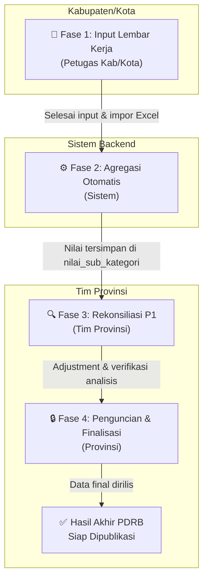

# 📊 Sirambo — Katalog Proyek Lengkap

> **Sistem Rekonsiliasi Angka PDRB (Sirambo)** adalah aplikasi web berbasis Laravel yang dirancang untuk membantu Badan Pusat Statistik (BPS) dalam menghitung, merekonsiliasi, dan menganalisis data Produk Domestik Regional Bruto (PDRB) di tingkat kabupaten/kota dan provinsi.

---

## 🗂️ Daftar Isi

1. [Ringkasan Eksekutif](#1-ringkasan-eksekutif)
2. [Stack Teknologi](#2-stack-teknologi)
3. [Arsitektur Sistem](#3-arsitektur-sistem)
4. [Peran Pengguna (User Roles)](#4-peran-pengguna-user-roles)
5. [Modul & Fitur Utama](#5-modul--fitur-utama)
6. [Struktur Database](#6-struktur-database)
7. [API & Endpoint Utama](#7-api--endpoint-utama)
8. [Alur Kerja (Workflow)](#8-alur-kerja-workflow)
9. [Dependensi Proyek](#9-dependensi-proyek)
10. [Struktur Direktori](#10-struktur-direktori)
11. [Panduan Instalasi Cepat](#11-panduan-instalasi-cepat)
12. [Konfigurasi Lingkungan](#12-konfigurasi-lingkungan)
13. [Dokumentasi Teknis Lanjutan](#13-dokumentasi-teknis-lanjutan)

---

## 1. Ringkasan Eksekutif

| Atribut         | Detail                                                       |
|-----------------|--------------------------------------------------------------|
| **Nama Sistem** | Sirambo (Sistem Rekonsiliasi Angka PDRB)                    |
| **Domain**      | Statistik Regional — BPS                                     |
| **Jenis**       | Aplikasi Web Internal (Government/Enterprise)                |
| **Framework**   | Laravel 12 (PHP >= 8.2)                                      |
| **Database**    | MySQL >= 8.0                                                 |
| **Lisensi**     | MIT                                                          |
| **Versi PHP**   | >= 8.2                                                       |

### Apa itu PDRB?

**Produk Domestik Regional Bruto (PDRB)** adalah nilai total barang dan jasa yang dihasilkan oleh suatu wilayah dalam periode tertentu (triwulan/tahunan). PDRB merupakan indikator utama untuk mengukur kinerja dan pertumbuhan ekonomi daerah.

### Problem yang Diselesaikan

Sebelum Sirambo, proses rekonsiliasi angka PDRB antar kabupaten/kota dengan provinsi dilakukan secara manual menggunakan spreadsheet Excel yang terpisah-pisah, rentan terhadap error manusia, tidak memiliki audit trail, dan sulit diselaraskan secara bersamaan. Sirambo hadir untuk:

- ✅ **Memusatkan** seluruh data PDRB dalam satu sistem terpusat
- ✅ **Mengotomatisasi** kalkulasi formula sektoral yang kompleks
- ✅ **Memfasilitasi** rekonsiliasi multi-level (kabupaten ↔ provinsi) secara real-time
- ✅ **Menyediakan** audit trail lengkap untuk setiap perubahan data
- ✅ **Mengintegrasikan** SSO BPS untuk autentikasi tunggal bagi seluruh pegawai

---

## 2. Stack Teknologi

```
┌─────────────────────────────────────────────────────────────┐
│                     LAPISAN PRESENTASI                       │
│  Blade Templates + Vanilla JS + CSS (dikompilasi via Vite)  │
├─────────────────────────────────────────────────────────────┤
│                      LAPISAN APLIKASI                        │
│         Laravel 12  ·  PHP 8.2+  ·  Queue Workers          │
├─────────────────────────────────────────────────────────────┤
│                      LAPISAN LAYANAN                         │
│   Laravel Reverb (WebSocket)  ·  Laravel Socialite (SSO)   │
├─────────────────────────────────────────────────────────────┤
│                       LAPISAN DATA                           │
│                  MySQL >= 8.0  (InnoDB)                     │
└─────────────────────────────────────────────────────────────┘
```

| Komponen            | Teknologi / Library                        | Versi          |
|---------------------|--------------------------------------------|----------------|
| Backend Framework   | Laravel                                    | ^12.0          |
| Bahasa Pemrograman  | PHP                                        | >= 8.2         |
| Database            | MySQL / MariaDB                            | >= 8.0 / 10.4  |
| Frontend Build Tool | Vite                                       | Latest         |
| Templating Engine   | Laravel Blade                              | Bawaan Laravel |
| Real-time Events    | Laravel Reverb (WebSocket Broadcasting)   | ^1.0           |
| Autentikasi SSO     | Laravel Socialite + Custom BPS Driver     | ^5.27          |
| Export Excel        | PhpSpreadsheet                             | ^5.5           |
| Testing             | PHPUnit                                    | ^11.5.3        |
| Code Formatter      | Laravel Pint                              | ^1.24          |

---

## 3. Arsitektur Sistem

### 3.1 Pola Arsitektur

Sirambo mengikuti pola **MVC (Model-View-Controller)** bawaan Laravel dengan beberapa lapisan tambahan:

```
Request HTTP
    │
    ▼
┌─────────────┐
│  Middleware │  (auth, akses.wilayah, role)
└──────┬──────┘
       │
       ▼
┌─────────────┐
│  Controller │  (Logika bisnis, validasi, koordinasi)
└──────┬──────┘
       │
       ├──────────────────────┐
       ▼                      ▼
┌─────────────┐        ┌─────────────┐
│    Model    │        │   Helpers   │
│ (Eloquent)  │        │ (format.php,│
└──────┬──────┘        │ PdrbHelper) │
       │               └─────────────┘
       ▼
┌─────────────┐
│   Database  │
│   (MySQL)   │
└─────────────┘
       │
       ▼
┌─────────────┐
│    View     │
│   (Blade)   │
└─────────────┘
```

### 3.2 Komponen Infrastruktur

| Komponen             | Detail                                                                                  |
|----------------------|-----------------------------------------------------------------------------------------|
| **Web Server**       | Laragon (lokal) / Apache / Nginx                                                        |
| **SSO Provider**     | Keycloak BPS (OpenID Connect) — `BpsProvider` custom driver via Socialite               |
| **WebSocket Server** | Laravel Reverb — menangani event `RekonP1LockUpdated` untuk sinkronisasi penguncian data |
| **Queue Worker**     | Laravel Queue — memproses job background (misal: kalkulasi masif, export)               |

---

## 4. Peran Pengguna (User Roles)

Sistem manajemen akses berbasis **role** yang membatasi menu dan visibilitas data wilayah:

| Role                   | Level        | Hak Akses Utama                                                                                                     |
|------------------------|--------------|---------------------------------------------------------------------------------------------------------------------|
| `provinsi`             | Administrator | Melihat data seluruh kab/kota, mengisi adjustment Rekon P1, melakukan rilis data, mengunci/membuka kunci form daerah |
| `provinsi_supervisor`  | Supervisor    | Setara `provinsi`, berfokus pada supervisi, verifikasi, dan persetujuan data akhir sebelum dirilis                  |
| `kabupaten`            | Operator      | Hanya data wilayahnya sendiri; mengisi Lembar Kerja, mengimpor template Excel, mencatat fenomena ekonomi            |
| `kota`                 | Operator      | Sama seperti `kabupaten`, dibedakan berdasarkan tipe wilayah administratif                                          |

### Middleware Keamanan

- **`akses.wilayah`** — Membatasi akses data hanya ke wilayah yang dimiliki user (kab/kota tidak bisa mengakses data kab/kota lain)
- **`role`** — Memvalidasi hak akses halaman berdasarkan role user; melempar `403 Forbidden` jika tidak sesuai

---

## 5. Modul & Fitur Utama

### 5.1 🗃️ Lembar Kerja (LK) — Input Data Sektoral

Modul utama yang digunakan petugas daerah untuk menginput data mentah PDRB per sektor.

**Fitur Unggulan:**
- **Template Dinamis Berbasis JSON** — Setiap sektor (Tanaman Pangan, Hortikultura, dll.) memiliki konfigurasi template sendiri di `config/lk_templates/*.json`. Template mendefinisikan kolom input, tipe data, dan rumus kalkulasi
- **Kalkulasi Otomatis Real-time** — Formula JavaScript dieksekusi langsung di browser saat user mengetik. Contoh formula tanaman pangan:
  ```js
  ((luas_panen || 0) * (produktivitas || 0)) / 10
  ```
- **Penyimpanan Hybrid (Kolom Tetap + JSON Dinamis)** — Nilai standar tersimpan di kolom database biasa; nilai sektoral khusus terserialisasi ke kolom `data_tambahan` (JSON)
- **Sinkronisasi ADHB ↔ ADHK** — Menambah komoditas di tab ADHB otomatis membuat baris yang sama di tab ADHK
- **Import Template Excel** — Mendukung import data massal dari file Excel sektoral

**Template Sektor yang Didukung:**
`tanaman_pangan.json`, `hortikultura.json`, dan sektor-sektor lainnya di `config/lk_templates/`

---

### 5.2 📈 Analisis PDRB

Sirambo menyediakan 6 jenis analisis untuk evaluasi pertumbuhan ekonomi regional:

| Analisis                       | Formula                                                          | Kegunaan                                              |
|-------------------------------|------------------------------------------------------------------|-------------------------------------------------------|
| **Q-to-Q** (Quarter-on-Quarter)| `((TW_N / TW_N-1) - 1) × 100`                                  | Pertumbuhan triwulan vs triwulan sebelumnya            |
| **Y-on-Y** (Year-on-Year)      | `((TW_N_T / TW_N_T-1) - 1) × 100`                              | Pertumbuhan triwulan vs triwulan sama tahun lalu       |
| **C-to-C** (Cumulative)        | Kumulatif triwulan berjalan vs kumulatif tahun lalu             | Pertumbuhan kumulatif tahunan                          |
| **Indeks Implisit**            | `(Nilai_ADHB / Nilai_ADHK) × 100`                               | Tingkat inflasi sektoral                               |
| **Struktur Dalam**             | `(NilaiSubKat / TotalPDRB_Wilayah) × 100`                      | Kontribusi sektor dalam satu wilayah                   |
| **Struktur Antar**             | `(PDRB_Kab / PDRB_Provinsi) × 100`                             | Andil kontribusi kab/kota terhadap provinsi            |

---

### 5.3 🔄 Rekonsiliasi P1 (Rekon P1)

Panel kerja eksklusif tim Provinsi untuk meninjau, menyesuaikan, dan memfinalisasi angka PDRB dari seluruh kabupaten/kota.

**Fitur:**

| Fitur                          | Deskripsi                                                                                                      |
|-------------------------------|----------------------------------------------------------------------------------------------------------------|
| **Adjustment (Penyesuaian)**   | Memasukkan nilai koreksi (`adj_berlaku` / `adj_konstan`). Nilai akhir = Nilai Awal + Adjustment                |
| **Recalculate Real-time**      | Tombol *Recalculate* memicu ulang kalkulasi QoQ, YoY, CtC, dan Indeks Implisit secara instan                  |
| **Multi-user Sync**            | Mekanisme AJAX polling + WebSocket via Laravel Reverb untuk sinkronisasi data antar-pengguna secara live       |
| **Log Audit Trail**            | Setiap perubahan adjustment dicatat di `nilai_sub_kategori_log` dan `nilai_kategori_log` (nilai lama vs baru)  |
| **Penguncian (Lock/Release)**  | Provinsi mengunci form kab/kota agar tidak bisa diubah selama proses finalisasi                                |
| **Cek Selisih**                | Menampilkan selisih antara jumlah PDRB kab/kota dengan angka agregat provinsi                                  |

---

### 5.4 🌾 Pencatatan Fenomena Ekonomi

Modul untuk mendokumentasikan peristiwa nyata di lapangan yang menjelaskan naik/turunnya angka PDRB.

| Fitur                    | Deskripsi                                                                                    |
|--------------------------|----------------------------------------------------------------------------------------------|
| **Pencatatan Terstruktur** | Dikaitkan dengan Kategori PDRB, Sub-Kategori, Periode (triwulan), dan Wilayah              |
| **Skala Dampak (1–5)**   | 1=Sangat Rendah, 2=Rendah, 3=Sedang, 4=Tinggi, 5=Sangat Tinggi                              |
| **Auto-lock (Deadline)** | Administrator menetapkan batas waktu; form fenomena terkunci otomatis setelah deadline        |
| **Ranking Fenomena**     | Menampilkan peringkat catatan fenomena berdasarkan rating dampak terbesar                    |
| **Export Excel**         | Seluruh catatan fenomena dapat diekspor ke file Excel untuk keperluan laporan                |

---

### 5.5 👤 Autentikasi & SSO BPS

| Mode Login    | Mekanisme                                                                       |
|---------------|---------------------------------------------------------------------------------|
| **Lokal**     | Username + Password, dicek terhadap tabel `users` (hash Bcrypt)                 |
| **SSO BPS**   | Keycloak OpenID Connect melalui custom driver `BpsProvider` (Laravel Socialite) |

Alur SSO: `Browser → /login/sso → Keycloak BPS → Callback → Cocokkan NIP/Email → Session Laravel`

---

### 5.6 📋 Fitur Pendukung Lainnya

| Fitur                    | Deskripsi                                                                           |
|--------------------------|-------------------------------------------------------------------------------------|
| **Dashboard**            | Ringkasan data PDRB terbaru, status rekonsiliasi, dan notifikasi sistem             |
| **Manajemen Pengguna**   | CRUD user beserta role dan assignment wilayah (Admin Provinsi)                      |
| **Rekon LK**             | Rekonsiliasi tingkat Lembar Kerja antar Provinsi-Kabupaten                          |
| **Import Log**           | Riwayat impor data Excel yang dapat diunduh kembali oleh Provinsi                   |
| **Data Penduduk**        | Pengelolaan data jumlah penduduk per wilayah (digunakan untuk PDRB per kapita)      |
| **Hasil PDRB**           | Tampilan ringkasan nilai akhir PDRB per kategori, wilayah, dan periode              |

---

## 6. Struktur Database

### 6.1 Diagram Relasi Entitas (ERD)

```
[provinsi] ───< [kabupaten]
                    │
                    ▼
               [wilayah] ──────< [users]
                    │
                    ├──< [nilai_sub_kategori] ─── [sub_kategori] ─── [kategori]
                    │
                    ├──< [nilai_kategori] ─────── [kategori]
                    │
                    ├──< [lembar_kerja]
                    │       └──< [lembar_kerja_item] ─── [komoditas]
                    │
                    ├──< [kunci_jawaban] / [pdrb_locks]
                    │
                    └──< [fenomena]
```

### 6.2 Ringkasan Tabel

| Kelompok                  | Tabel                                                                 | Fungsi                                    |
|---------------------------|-----------------------------------------------------------------------|-------------------------------------------|
| **Master Wilayah**        | `provinsi`, `kabupaten`, `wilayah`                                   | Hierarki geografis                        |
| **Master Pengguna**       | `users`                                                               | Akun, role, dan asosiasi wilayah          |
| **Klasifikasi PDRB**      | `kategori`, `sub_kategori`, `tahun`, `periode`                       | Master data lapangan usaha dan waktu      |
| **Nilai Hasil PDRB**      | `nilai_sub_kategori`, `nilai_kategori`                               | Angka PDRB final per wilayah/periode      |
| **Lembar Kerja**          | `lembar_kerja`, `lembar_kerja_item`, `komoditas`                     | Transaksi input data sektoral             |
| **Kontrol & Audit**       | `kunci_jawaban`, `pdrb_locks`, `nilai_sub_kategori_log`, `nilai_kategori_log` | Penguncian dan riwayat perubahan |
| **Fenomena**              | `fenomena`, `histori_fenomena`                                        | Catatan peristiwa ekonomi lapangan        |
| **Rekonsiliasi LK**       | `rekon_lembar_kerja`, `rekon_lembar_kerja_log`                       | Rekonsiliasi worksheet kab/kota-provinsi  |

### 6.3 Penjelasan Kolom Kunci

**`lembar_kerja_item`** — Kolom penting:
- `tipe_pdrb` → `'berlaku'` (ADHB) atau `'konstan'` (ADHK)
- `output_adh` → Output Atas Dasar Harga
- `nilai_ntb` → Nilai Tambah Bruto
- **`data_tambahan`** → JSON blob untuk nilai sektoral dinamis (luas_panen, produktivitas, populasi_ternak, dll.)

**`nilai_sub_kategori` / `nilai_kategori`** — Kolom kunci:
- `tahap_data` → `'awal'` (dari kab/kota) atau `'rekonsiliasi'` (setelah adjustment provinsi)
- `tipe_pdrb` → `'berlaku'` atau `'konstan'`

---

## 7. API & Endpoint Utama

### 7.1 Autentikasi

| Method | Endpoint                | Deskripsi                             |
|--------|-------------------------|---------------------------------------|
| GET    | `/login`                | Halaman login lokal                   |
| POST   | `/login`                | Proses autentikasi lokal              |
| POST   | `/logout`               | Mengakhiri sesi pengguna              |
| GET    | `/login/sso`            | Redirect ke Keycloak SSO BPS          |
| GET    | `/login/sso/callback`   | Callback penerima token SSO           |

### 7.2 Lembar Kerja

| Method | Endpoint                                    | Deskripsi                                  |
|--------|---------------------------------------------|--------------------------------------------|
| GET    | `/lembar-kerja`                             | Daftar kategori Lembar Kerja               |
| GET    | `/lembar-kerja/detail/{id_sub_kategori}`    | Form input komoditas sektoral              |
| POST   | `/lembar-kerja/detail/{id_sub_kategori}`    | Simpan data Lembar Kerja                   |
| DELETE | `/lembar-kerja/detail/{id}/reset`           | Reset nilai form                           |
| POST   | `/lembar-kerja/detail/{id}/komoditas`       | Tambah komoditas kustom                    |
| GET    | `/lembar-kerja/rekap`                       | Rekapitulasi output ADH dan NTB            |

### 7.3 Rekonsiliasi P1

| Method | Endpoint                              | Deskripsi                                  |
|--------|---------------------------------------|--------------------------------------------|
| GET    | `/rekonsiliasi-p1`                    | Master tabel evaluasi PDRB semua wilayah   |
| GET    | `/rekonsiliasi-p1/detail/{id}`        | Form adjustment nilai sub-kategori         |
| POST   | `/rekonsiliasi-p1/save-adjustment`    | Simpan nilai adjustment                    |
| POST   | `/rekonsiliasi-p1/recalculate`        | Hitung ulang metrik pertumbuhan            |
| GET    | `/rekonsiliasi-p1/poll-updates`       | AJAX polling sinkronisasi multi-user       |
| POST   | `/rekonsiliasi-p1/lock`               | Toggle kunci form                          |

### 7.4 Analisis PDRB

| Method | Endpoint                            | Jenis Analisis              |
|--------|-------------------------------------|-----------------------------|
| GET    | `/rekonsiliasi/qtoq`                | Quarter-on-Quarter          |
| GET    | `/rekonsiliasi/yony`                | Year-on-Year                |
| GET    | `/rekonsiliasi/ctoc`                | Cumulative-to-Cumulative    |
| GET    | `/rekonsiliasi/indeksImplisit`      | Indeks Harga Implisit       |
| GET    | `/rekonsiliasi/lajuImplisit`        | Laju Indeks Implisit        |
| GET    | `/rekonsiliasi/stukturDalam`        | Struktur Kontribusi Sektoral|
| GET    | `/rekonsiliasi/stukturAntar`        | Struktur Antar Wilayah      |
| GET    | `/rekonsiliasi/cek-selisih`         | Cek Selisih Kab/Prov        |

### 7.5 Fenomena Ekonomi

| Method | Endpoint                   | Deskripsi                        |
|--------|----------------------------|----------------------------------|
| GET    | `/fenomena`                | Daftar catatan fenomena          |
| POST   | `/fenomena`                | Tambah catatan fenomena baru     |
| PUT    | `/fenomena/{id}`           | Perbarui catatan fenomena        |
| DELETE | `/fenomena/{id}`           | Hapus catatan fenomena           |
| GET    | `/fenomena/ranking`        | Peringkat fenomena by dampak     |
| GET    | `/fenomena/export`         | Export ke Excel                  |
| POST   | `/fenomena/toggle-lock`    | Toggle kunci menu fenomena       |

---

## 8. Alur Kerja (Workflow)



### Penjelasan Setiap Fase

**Fase 1 — Input Lembar Kerja (Kab/Kota)**
- Petugas mengisi kuantum produksi, harga produsen, dan indikator sektoral via form LK
- Kalkulasi formula otomatis berjalan di browser (JavaScript)
- Data tersimpan dengan status `tahap_data = 'awal'`

**Fase 2 — Agregasi Otomatis (Sistem)**
- Data LK diagregasi (dijumlahkan) ke level sub-kategori dan kategori
- Tersimpan ke `nilai_sub_kategori` dan `nilai_kategori`

**Fase 3 — Rekonsiliasi P1 & Adjustment (Provinsi)**
- Tim Provinsi memantau data dari semua kab/kota
- Memasukkan nilai penyesuaian jika diperlukan
- Perubahan dicatat sebagai `tahap_data = 'rekonsiliasi'` dengan log lengkap

**Fase 4 — Penguncian & Finalisasi (Provinsi)**
- Provinsi mengevaluasi indikator makro (QoQ, YoY, CtC, Implisit)
- Mengunci data kab/kota agar tidak bisa diubah lagi
- Penguncian bisa dilakukan manual atau dijadwalkan otomatis (deadline)

---

## 9. Dependensi Proyek

### 9.1 Dependensi PHP (Production)

| Package                     | Versi    | Fungsi                                            |
|-----------------------------|----------|---------------------------------------------------|
| `laravel/framework`         | ^12.0    | Framework utama MVC, ORM, Queue, Events, dll.     |
| `laravel/reverb`            | ^1.0     | WebSocket server untuk real-time broadcasting     |
| `laravel/socialite`         | ^5.27    | OAuth/SSO provider (custom BPS Keycloak driver)   |
| `laravel/tinker`            | ^2.10.1  | REPL interaktif untuk debugging                   |
| `phpoffice/phpspreadsheet`  | ^5.5     | Baca/tulis file Excel (import & export)           |

### 9.2 Dependensi PHP (Development)

| Package                 | Versi     | Fungsi                                      |
|-------------------------|-----------|---------------------------------------------|
| `laravel/pail`          | ^1.2.2    | Real-time log viewer di terminal            |
| `laravel/pint`          | ^1.24     | Code style fixer (PSR-12)                   |
| `laravel/sail`          | ^1.41     | Docker environment untuk development        |
| `phpunit/phpunit`       | ^11.5.3   | Framework testing                           |
| `fakerphp/faker`        | ^1.23     | Generator data palsu untuk seeder           |

### 9.3 Helper Kustom

| File                       | Fungsi                                               |
|----------------------------|------------------------------------------------------|
| `app/Helpers/format.php`   | Fungsi helper formatting angka (rupiah, persen, dll.) |
| `app/Helpers/PdrbHelper.php`| Fungsi kalkulasi spesifik domain PDRB               |

---

## 10. Struktur Direktori

```
pdrb-app/
├── app/
│   ├── Console/              # Artisan commands (scheduled tasks)
│   ├── Events/               # Event classes (RekonP1LockUpdated, dll.)
│   ├── Exports/              # Excel export classes (PhpSpreadsheet)
│   ├── Helpers/
│   │   ├── format.php        # Helper format angka/rupiah
│   │   └── PdrbHelper.php    # Helper kalkulasi PDRB
│   ├── Http/
│   │   ├── Controllers/
│   │   │   ├── Admin/        # Controller manajemen admin
│   │   │   ├── AuthController.php
│   │   │   ├── DashboardController.php
│   │   │   ├── DynamicTableController.php
│   │   │   ├── FenomenaController.php
│   │   │   ├── HasilPdrbController.php
│   │   │   ├── LembarKerjaController.php
│   │   │   ├── PdrbController.php
│   │   │   ├── RekonLkController.php
│   │   │   ├── RekonP1Controller.php
│   │   │   ├── RekonsiliasiController.php
│   │   │   ├── SsoController.php
│   │   │   └── ... (lainnya)
│   │   └── Middleware/
│   │       ├── AksesWilayah.php  # Pembatas wilayah kab/kota
│   │       └── RoleMiddleware.php # Guard berbasis role
│   ├── Models/
│   │   ├── User.php, Wilayah.php, Kabupaten.php, Provinsi.php
│   │   ├── Kategori.php, SubKategori.php, Tahun.php, Periode.php
│   │   ├── NilaiSubKategori.php, NilaiKategori.php
│   │   ├── Fenomena.php, KunciJawaban.php, PdrbLock.php
│   │   └── ... (18 model total)
│   ├── Providers/            # Service providers
│   └── Socialite/            # Custom BPS Keycloak SSO driver
│
├── config/
│   └── lk_templates/         # File JSON template Lembar Kerja per sektor
│       ├── tanaman_pangan.json
│       ├── hortikultura.json
│       └── ...
│
├── database/
│   ├── migrations/           # Migrasi schema database
│   ├── seeders/              # Seeder data awal
│   └── factories/            # Factory untuk testing
│
├── docs/                     # Dokumentasi teknis terstruktur
│   ├── 1-arsitektur-dan-alur.md
│   ├── 2-instalasi-dan-konfigurasi.md
│   ├── 3-fitur-dan-modul.md
│   ├── 4-struktur-database.md
│   └── 5-rute-dan-controller.md
│
├── resources/
│   ├── css/app.css           # Stylesheet utama aplikasi
│   ├── js/app.js             # Entry point JavaScript
│   └── views/                # Blade template views
│       ├── auth/             # Halaman login/SSO
│       ├── dashboard/        # Halaman beranda
│       ├── lembar_kerja/     # Views LK
│       ├── rekon_p1/         # Views Rekonsiliasi P1
│       ├── fenomena/         # Views Fenomena Ekonomi
│       └── ...
│
├── routes/
│   └── web.php               # Definisi seluruh route aplikasi
│
├── sirambow_sirambo.sql      # Database dump utama
├── composer.json             # Dependensi PHP
├── package.json              # Dependensi Frontend
├── vite.config.js            # Konfigurasi Vite bundler
└── .env.example              # Template konfigurasi environment
```

---

## 11. Panduan Instalasi Cepat

### Prasyarat Sistem

| Kebutuhan    | Versi Minimum | Catatan                                        |
|--------------|---------------|------------------------------------------------|
| PHP          | >= 8.2        | Ekstensi: `pdo_mysql`, `openssl`, `mbstring`, `xml`, `curl`, `zip`, `gd` |
| MySQL        | >= 8.0        | Atau MariaDB >= 10.4                           |
| Composer     | Latest        | [getcomposer.org](https://getcomposer.org)     |
| Node.js      | Latest LTS    | Untuk kompilasi asset via Vite                 |
| Web Server   | —             | Laragon (rekomendasi Windows), XAMPP, Nginx    |

### Langkah-langkah

```bash
# 1. Clone repositori
git clone <url-repository> pdrb-app
cd pdrb-app

# 2. Instal dependensi PHP
composer install

# 3. Instal dependensi Frontend
npm install

# 4. Setup file konfigurasi
cp .env.example .env
php artisan key:generate

# 5. Buat database baru di MySQL bernama 'sirambo'
# kemudian import file dump SQL:
# mysql -u root -p sirambo < sirambow_sirambo.sql
# (atau gunakan phpMyAdmin / HeidiSQL)

# 6. Sesuaikan konfigurasi database di .env
# DB_DATABASE=sirambo
# DB_USERNAME=root
# DB_PASSWORD=

# 7. Jalankan server pengembangan (semua layanan sekaligus)
composer run dev
# Atau manual:
php artisan serve
npm run dev
```

> **Akses aplikasi:** [http://127.0.0.1:8000](http://127.0.0.1:8000)

---

## 12. Konfigurasi Lingkungan

File `.env` utama yang perlu dikonfigurasi:

```env
# ── Aplikasi ──────────────────────────────────
APP_NAME=Sirambo
APP_ENV=local
APP_KEY=                          # Diisi otomatis oleh: php artisan key:generate
APP_DEBUG=true
APP_URL=http://pdrb-app.test      # Sesuaikan dengan domain virtualhost lokal

# ── Database ──────────────────────────────────
DB_CONNECTION=mysql
DB_HOST=127.0.0.1
DB_PORT=3306
DB_DATABASE=sirambo
DB_USERNAME=root
DB_PASSWORD=

# ── SSO BPS (Keycloak) ────────────────────────
BPS_SSO_BASE_URL=https://sso.bps.go.id
BPS_SSO_REALM=pegawai-bps
BPS_SSO_CLIENT_ID=<nama-client-anda>
BPS_SSO_CLIENT_SECRET=<kunci-rahasia-client>
BPS_SSO_REDIRECT_URI=http://pdrb-app.test/login/sso/callback

# ── Laravel Reverb (WebSocket) ────────────────
REVERB_APP_ID=
REVERB_APP_KEY=
REVERB_APP_SECRET=
REVERB_HOST=localhost
REVERB_PORT=8080
REVERB_SCHEME=http
```

> ⚠️ **Penting:** `BPS_SSO_REDIRECT_URI` harus didaftarkan pula di console developer Keycloak agar tidak terjadi error `invalid_redirect_uri`.

---

## 13. Dokumentasi Teknis Lanjutan

Untuk detail lebih mendalam, tersedia dokumentasi terstruktur di folder `docs/`:

| No. | Dokumen                                                                                   | Isi Utama                                                  |
|-----|-------------------------------------------------------------------------------------------|------------------------------------------------------------|
| 1   | [Arsitektur dan Alur Sistem](./docs/1-arsitektur-dan-alur.md)                            | Tech stack, peran user, diagram alur kerja 4 fase          |
| 2   | [Instalasi dan Konfigurasi](./docs/2-instalasi-dan-konfigurasi.md)                       | Prasyarat sistem, langkah setup, konfigurasi SSO           |
| 3   | [Fitur dan Modul](./docs/3-fitur-dan-modul.md)                                           | Lembar Kerja JSON, analisis PDRB, Rekon P1, Fenomena       |
| 4   | [Struktur Database](./docs/4-struktur-database.md)                                       | ERD, kamus data seluruh tabel, penjelasan kolom kunci      |
| 5   | [Rute dan Controller](./docs/5-rute-dan-controller.md)                                   | Mapping endpoint, controller, dan middleware kustom         |

---

<div align="center">

**Sirambo** — Sistem Rekonsiliasi Angka PDRB  
*Dikembangkan untuk Badan Pusat Statistik (BPS)*

</div>
