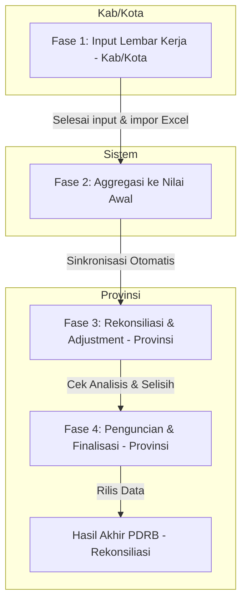

# 1. Arsitektur dan Alur Sistem

Dokumen ini menjelaskan arsitektur teknologi, hak akses pengguna (roles), dan alur bisnis utama dalam aplikasi **Sirambo (PDRB App)**.

---

## 1.1 Stack Teknologi Utama

Aplikasi Sirambo dibangun dengan basis framework **Laravel** dan arsitektur web modern:

* **Backend Framework**: Laravel 11 (PHP >= 8.2)
* **Frontend**: Blade Templating, Vanilla JS, CSS (dikompilasi menggunakan **Vite**)
* **Database**: MySQL >= 8.0 (Menggunakan DB engine InnoDB untuk integritas data transaksi melalui `DB::transaction`)
* **Autentikasi SSO**: Keycloak Terintegrasi dengan SSO BPS melalui **Laravel Socialite** (Custom Driver: BpsProvider)
* **Real-time Eventing**: Laravel Reverb/Broadcasting untuk sinkronisasi lock/unlock data secara instan (`RekonP1LockUpdated` event)

---

## 1.2 Peran Pengguna (User Roles)

Aplikasi memiliki sistem manajemen hak akses berbasis role yang membatasi menu dan data wilayah:

| Role | Deskripsi Hak Akses |
|---|---|
| **provinsi** | Hak akses administrator tingkat Provinsi. Dapat melihat data seluruh kabupaten/kota, memasukkan penyesuaian (Adjustment) pada Rekonsiliasi P1, melakukan rilis data, mengunci/membuka kunci input wilayah, serta mengunduh log impor. |
| **provinsi_supervisor** | Setara dengan role provinsi, fokus pada verifikasi, supervisi, dan penguncian/persetujuan data akhir sebelum dirilis. |
| **kabupaten** / **kota** | Hak akses untuk petugas BPS di tingkat Kabupaten/Kota. Hanya diizinkan melihat dan mengedit data wilayah mereka sendiri (dibatasi oleh middleware `akses.wilayah`). Fungsionalitas utama meliputi pengisian Lembar Kerja (LK), pengunggahan (import) template excel sektoral, dan pencatatan fenomena ekonomi daerah. |

---

## 1.3 Alur Kerja Utama (Workflow)

Proses pengolahan data PDRB di aplikasi Sirambo terbagi dalam 4 fase utama:

### Penjelasan Detail Alur Kerja:

1. **Fase 1: Input Lembar Kerja (Tingkat Kabupaten/Kota)**
   * Petugas daerah menginput kuantum produksi, harga produsen, atau indikator sektoral lainnya melalui menu **Lembar Kerja**.
   * Sistem secara otomatis menghitung nilai turunan (seperti Output ADH, Konsumsi Antara, dan Nilai Tambah Bruto) secara real-time di browser berdasarkan rumus template JSON.
   * Data ini disimpan sebagai data **Awal** dengan tanda `tahap_data = 'awal'`.

2. **Fase 2: Aggregasi Otomatis**
   * Data dari Lembar Kerja di-aggregasi (dijumlahkan) ke tingkat sub-kategori dan kategori PDRB.
   * Nilai tersebut disimpan ke tabel `nilai_sub_kategori` dan `nilai_kategori` dengan status `tahap_data = 'awal'`.

3. **Fase 3: Rekonsiliasi P1 & Penyesuaian (Tingkat Provinsi)**
   * Tim Provinsi memantau data yang dikirim oleh seluruh Kabupaten/Kota.
   * Tim Provinsi dapat memberikan **Adjustment** (nilai penyesuaian tambah/kurang) untuk menyelaraskan angka PDRB antarwilayah.
   * Perubahan ini direkam sebagai data **Rekonsiliasi** (`tahap_data = 'rekonsiliasi'`) dengan log riwayat perubahan yang lengkap.

4. **Fase 4: Evaluasi & Penguncian (Locking)**
   * Provinsi mengevaluasi indikator makro seperti pertumbuhan **Q-to-Q**, **Y-on-Y**, **C-to-C**, dan **Indeks Implisit**.
   * Setelah angka disepakati, Provinsi mengunci data wilayah tersebut (melalui model `KunciJawaban` atau `PdrbLock`) agar Kabupaten/Kota tidak dapat mengubah data input lagi. Penguncian bisa dilakukan manual atau dijadwalkan otomatis.
